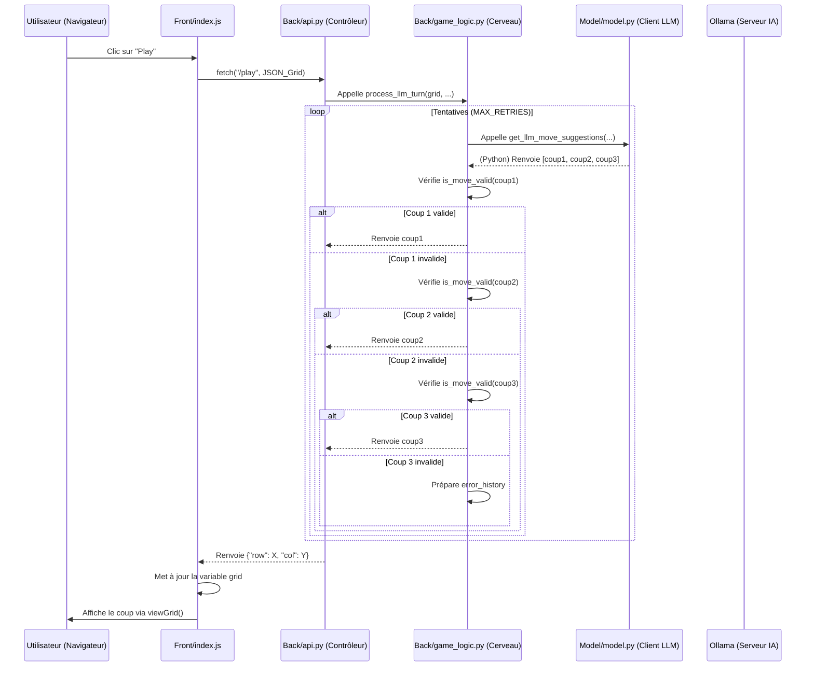

# tictactoe
Création d'un jeu du morpion IA vs IA

# Objectif du projet

Faire affronter des LLM dans un jeu du morpion dans une grille 10x10. Le système gère l'alternance des tours, la validité des coups des LLM et l'affichage dynamique de la partie.

## Schématisation des responsabilités

### Front/index.js

- Affiche la grille ```viewGrid```
- Envoie la requête HTTP ```fetch``` quand on clique

### Back/api.py

- Gère le HTTP
- Reçoit la requête JSON, la valide grâce ```MoveRequest``` et délègue immédiatement le travail
- Il gère les erreurs finales (HTTP 500, 400...)

### Back/game_logic.py

- Contient la boucle de tentative ```process_llm_turn```
- Contient la logique de vérification des coups```is_move_valid```
- Prochainement implémentation de la condition de victoire

### Model/model.py

- Construit les prompts (utilisation de ```format_grid_for_llm```)
- Appelle le modèle (pour l'instant de Ollama, httpx pour les requêtes)
- Parse la réponse JSON du LLM

## Schéma - Diagramme de séquence


