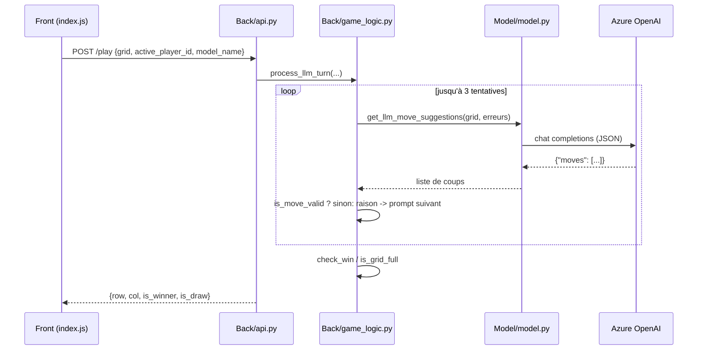

<h1 align="center">tictactoe</h1>

<p align="center">
  Deux modèles de langage s'affrontent au morpion sur une grille 10x10 (alignement
  de 5). Le serveur gère l'alternance des tours, force la validité des coups
  proposés par les LLM et renvoie l'état de la partie.
</p>

<p align="center">
  
  
  
</p>

<!-- [PAS ENCORE LIVRE] P1 :
<p align="center"></p>
-->

---

## Le problème

Un LLM sait décrire une stratégie de morpion, mais quand on lui demande un coup, il
propose régulièrement une case déjà occupée, hors grille, ou un JSON mal formé.
L'enjeu technique : obtenir de lui, à chaque tour, un coup **toujours valide** dans
un format **exploitable**, sans intervention humaine.

## La solution

- **Client LLM** (`Model/model.py`) : `LLMClient` interroge un déploiement
  **Azure OpenAI** (`gpt-4o` ou `o4-mini`) en HTTP asynchrone (`httpx`).
  - `format_grid_for_llm` transforme la grille numérique en tableau texte lisible ;
  - un prompt système fixe des priorités stratégiques ordonnées (gagner, bloquer,
    double menace, étendre, centre, bord) ;
  - le prompt utilisateur inclut l'état de la grille et l'**historique des erreurs**
    du tour en cours ;
  - la requête force `response_format: json_object` ;
  - `_parse_llm_response` valide la structure `{"moves": [...]}` et lève une erreur
    typée (401 clé, 502 serveur, 500 réponse non exploitable).
- **Arbitrage et règles** (`Back/game_logic.py`) :
  - `process_llm_turn` : boucle de correction. Si les 3 coups proposés sont
    invalides, on renvoie au LLM **la raison du rejet dans le prompt suivant** et on
    réessaie (3 tentatives maximum).
  - `is_move_valid` : contrôle des types, des bornes et de la case vide.
  - `check_win` : détection d'un alignement de 5 dans les 4 directions (comptage
    bidirectionnel depuis le dernier coup) ; `is_grid_full` pour le match nul.
- **API** (`Back/api.py`) : `POST /play` déclenche un tour et renvoie
  `{row, col, player_id, is_winner, is_draw}`.
- **Interface** (`Front/`) : grille HTML/JS, appels `fetch` vers l'API.
- **Déploiement** : Azure Static Web Apps (`.github/workflows/`).

## Architecture


```mermaid
sequenceDiagram
    participant F as Front (index.js)
    participant A as Back/api.py
    participant G as Back/game_logic.py
    participant M as Model/model.py
    participant O as Azure OpenAI
    F->>A: POST /play {grid, active_player_id, model_name}
    A->>G: process_llm_turn(...)
    loop jusqu'à 3 tentatives
        G->>M: get_llm_move_suggestions(grid, erreurs)
        M->>O: chat completions (JSON)
        O-->>M: {"moves": [...]}
        M-->>G: liste de coups
        G->>G: is_move_valid ? sinon: raison -> prompt suivant
    end
    G->>G: check_win / is_grid_full
    A-->>F: {row, col, is_winner, is_draw}
```

## Stack technique

| Domaine | Outils |
|---|---|
| LLM | Azure OpenAI (`gpt-4o`, `o4-mini`) |
| Client HTTP | `httpx` (asynchrone) |
| API | FastAPI |
| Front | HTML, CSS, JavaScript |
| Packaging / déploiement | poetry, Azure Static Web Apps |

## Installation

Prérequis : **Python 3.12+**, [poetry](https://python-poetry.org/), un déploiement
**Azure OpenAI** (modèle `gpt-4o`).

```bash
git clone <url-du-repo> && cd tictactoe
poetry install

cat > .env <<'ENV'
URL_GPT4O=https://<votre-ressource>.openai.azure.com/openai/deployments/gpt-4o/chat/completions?api-version=2024-12-01-preview
KEY_GPT4O=<votre-cle>
ENV
```

## Utilisation

```bash
poetry run uvicorn Back.api:app --reload    # API sur http://127.0.0.1:8000
# puis servir Front/ (ex. python -m http.server) et ouvrir index.html
```

Une démo jouable en ligne est prévue. [PAS ENCORE LIVRE]

## Résultats

**Aucune mesure n'est encore publiée.** [PAS ENCORE LIVRE] Un indicateur utile sera
versionné : le **taux de coups invalides par tentative**, par modèle, sur un lot de
parties - il quantifie l'apport de la boucle de correction. Aucun chiffre n'est
avancé ici tant que cette mesure n'existe pas.

## Limites connues

- La qualité de jeu des LLM au morpion 10x10 reste faible ; l'intérêt du projet est
  l'ingénierie autour du LLM, pas la performance au jeu.
- Dépendance à un déploiement Azure OpenAI (clé, quota).
- `test_ollama.py` présent à la racine est un script d'essai, pas un test ; il sera
  retiré. [PAS ENCORE LIVRE]

## Améliorations futures

- Tests de la logique pure (`check_win`, `is_move_valid`, analyse de réponses
  mockées).
- Comparaison `gpt-4o` / `o4-mini` : qualité de jeu, coût, latence.
- Adversaire heuristique (minimax limité) comme point de référence.

## Ce que ce projet démontre

Intégration d'un LLM dans une application (client HTTP asynchrone, prompt système et
utilisateur, format de sortie contraint) ; robustesse face aux réponses invalides
(analyse défensive du JSON, erreurs typées) ; **boucle d'agent auto-corrigé**
(ré-injection de l'erreur dans le prompt) ; API FastAPI.

## Licence

Distribué sous licence MIT. Voir le fichier [LICENSE](LICENSE).
